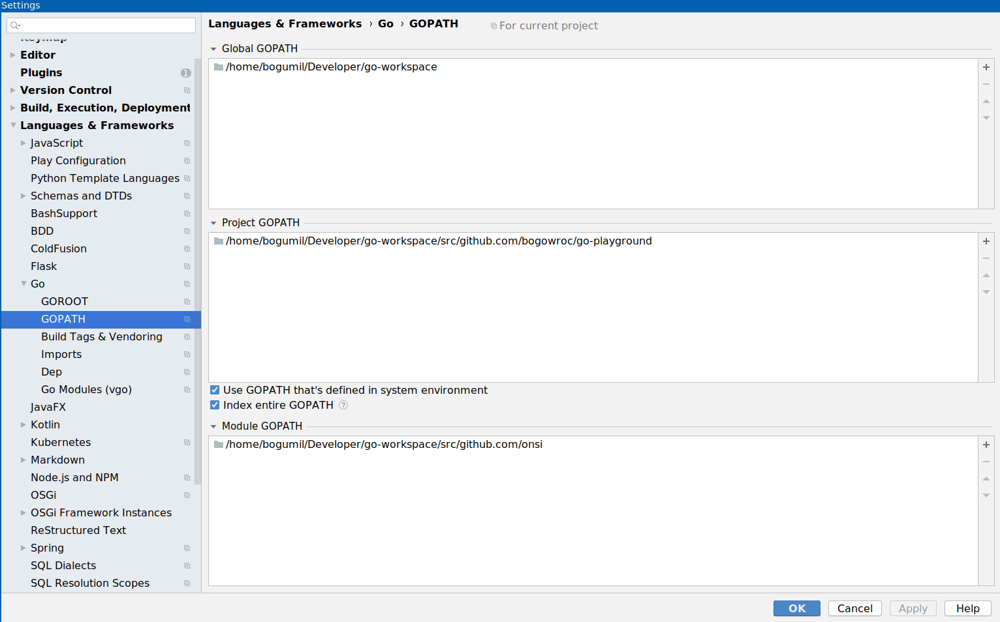

How to Write Go Code 
====================
	https://golang.org/doc/code.html

Tips & Tricks
=============
	https://peter.bourgon.org/go-best-practices-2016/#repository-structure
	https://medium.com/@benbjohnson/standard-package-layout-7cdbc8391fc1

Effective go
============
	https://golang.org/doc/effective_go.html

FAQ
===
	https://golang.org/doc/faq

Testing and Mocking
===================
	https://blog.codecentric.de/2019/07/gomock-vs-testify/
	https://blog.alexellis.io/golang-writing-unit-tests/

	BDD testing library
	-------------------
	https://github.com/onsi/ginkgo

Error handling
==============
	https://blog.golang.org/error-handling-and-go
	https://blog.golang.org/errors-are-values
	https://blog.golang.org/defer-panic-and-recover

Examples
========
	https://gobyexample.com/

A Golang BDD Testing framework
==============================

    https://github.com/onsi/ginkgo

# Installation 

    go get -u github.com/onsi/ginkgo/ginkgo  # installs the ginkgo CLI
    go get -u github.com/onsi/gomega/...     # fetches the matcher library

# IntelliJ configuration

